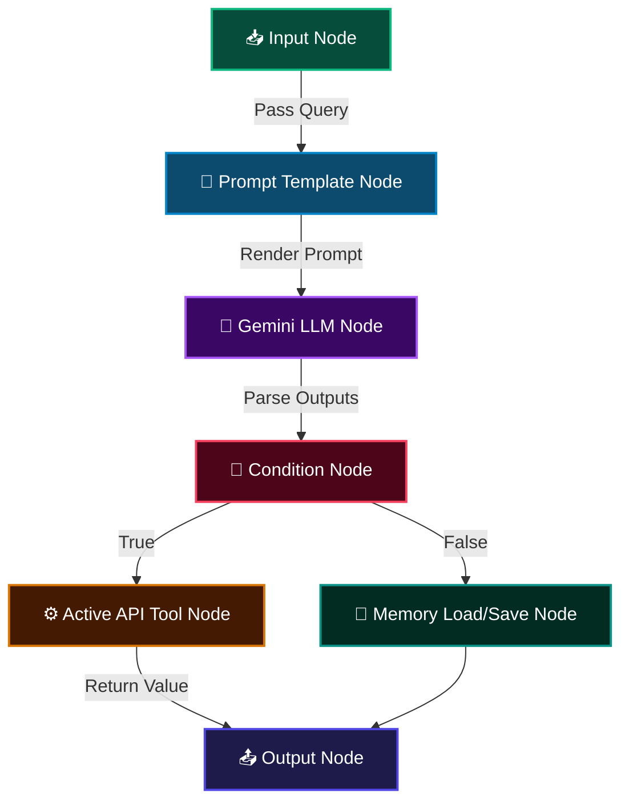

# 🌌 OpenAgent

**OpenAgent** is a next-generation, high-performance, modular no-code platform for designing, visualizing, and executing AI agent workflows. Built with a sleek dark aesthetic, it empowers developers and organizers to wire inputs, prompt templates, Gemini LLM nodes, persistent memory variables, and API tools together on an interactive canvas.

Designed as the core submission for the **GDG JIIT 128 BitBox 2026 Hackathon**, OpenAgent makes creating AI pipelines as intuitive as drawing a flowchart.

---

## 🚀 Key Features

*   **Interactive Visual Builder**: Seamless drag-and-drop workspace powered by React Flow with custom nodes, floating control panels, and grid snaps.
*   **Gemini AI Node Integration**: Connect Google Gemini models (`Gemini 1.5 Pro`, `Gemini 2.0 Flash`, etc.) with customized temperature, token parameters, and system prompts.
*   **Variable Context Store**: A stateful variables engine that propagates data across the workflow, supporting inputs, intermediate outputs, and tools.
*   **Stateful Memory Operations**: Persist, load, and clear custom variables dynamically across workflow iterations using memory nodes.
*   **Active Tool API Integrations**:
    *   🔍 **Web Search (DDG)**: Run search queries in real-time.
    *   🧮 **Math Calculator**: Perform logic calculations.
    *   📄 **URL Content Scraper**: Fetch and scrape content from public web URLs.
    *   🎨 **Image Generation**: Generate visuals directly inside the pipeline.
*   **Conditional Routing Engine**: Route workflow execution paths using operators (`==`, `!=`, `contains`, `>`, `<`).
*   **Real-time Console & Outputs**: Watch your agent think in real-time with live log execution and variables inspector panels.
*   **Premium Glassmorphic Theme**: Dark oklch color palettes, animated paths, custom scrollbars, and floating capsule navigation interfaces.

---

## 🛠️ Architecture Flow



---

## 🏃 Getting Started

### Prerequisites

*   Node.js (v18.0.0 or higher)
*   npm or pnpm

### Installation

1.  **Clone the repository**:
    ```bash
    git clone https://github.com/Shourya523/OpenAgent
    cd openagent/OpenAgent
    ```

2.  **Install dependencies**:
    ```bash
    npm install
    ```

3.  **Run the development server**:
    ```bash
    npm run dev
    ```

4.  **Open the application**:
    Navigate to [http://localhost:3000](http://localhost:3000) in your browser.

---

## 🧩 Node Options & Specifications

| Node Type | Icon | Configurable Fields | Purpose |
| :--- | :---: | :--- | :--- |
| **Input Node** | 📥 | Variable Name, Default Value, Placeholder | Defines the query or payload parameters to trigger the run. |
| **Prompt Node** | 📝 | Template Name, Prompt Template text | Binds variables inside templates (e.g. `{{user_query}}`). |
| **LLM Node** | 🧠 | Model, System Prompt, Temperature, Outputs | Connects the context directly to Gemini API generative runs. |
| **Tool Node** | ⚙️ | Web Search, Scraper, Calculator, Image Gen | Executes runtime function calls using active web microservices. |
| **Memory Node** | 💾 | Operation (Load/Save/Clear), Target Variable | Stores outputs locally or retrieves past workflow contexts. |
| **Condition Node** | 🔀 | Left Operand, Operator, Right Operand | Implements branching control flow based on variable comparison. |
| **Output Node** | 📤 | Output Variable, Format (Text/Markdown/JSON) | Formats and prints the final payload result for webhook/user consumption. |

---

## 🛡️ Built With

*   **Next.js 16** - React 19 framework with App Router.
*   **React Flow (xyflow)** - High-fidelity nodes canvas representation.
*   **Gemini AI SDK** - Powering agent generation calls.
*   **Lucide Icons** - Clean vector icons suite.
*   **Tailwind CSS v4 & Motion** - Custom inline styling theme and page transitions.

---

## 👥 GDG JIIT 128 Chapter

OpenAgent was created with passion by the core development members of GDG JIIT 128.
For any issues, feedback, or collaboration queries, contact us at [gdgjiit128@gmail.com](mailto:gdgjiit128@gmail.com).
